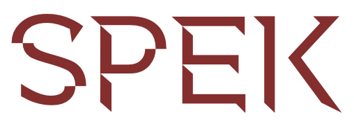

# Spek



Spek is a lightweight function builder style Behavior Driven Development framework, designed to be used with XCTest

## Usage

⚠️Before using any test frameworks, you need to ensure there is `XCTest` framework in your test target.

```swift
import XCTest
@testable import Spek

final class SpekTests: XCTestCase {
    func testExample() {
        var left = 1
        var right = 1

        spec {
            Describe("math") {
                BeforeEach {
                    left = 2
                }

                Describe("basic") {
                    BeforeEach {
                        right = 3
                    }

                    AfterEach {

                    }

                    It("adds correctly") {
                        XCTAssertEqual(left + right, 5)
                    }

                    It("multiplies correctly") {
                        XCTAssertEqual(left * right, 6)
                    }
                }
            }
        }
    }
}
```

## Features

- Support common BDD parts: Describe, Context, BeforeAll, AfterAll, BeforeEach, AfterEach, It
- To disable a part, prefix it with `X`, for example `XDescribe`, `XIt`, ...
- All blocks are throwing function, so are encouraged to `do try catch`
- `BeforeAll` and `AfterAll` are run before and after all enclosing `Describe` and `It`
- `BeforeEach` and `AfterEach` are run before and after all enclosing `It`
- `Context` behaves the same as `Describe`

## How to

### Disable a block

When you have an imcomplete block, instead of commenting it out, you can prefix it with `X` so it won't be executed

```swift
Describe("math") {
    It("will be run") {

    }

    XIt("won't be run") {

    }
}
```

### Declare local variables

Spek uses Swift 5.1 function builder so you can only declare block and nested block. To declare local variables in a subspec, you need to use `Sub` and return `Describe` explicitly

```swift
Describe("math") {
    Describe("advanced") {

    }

    Sub {
        let abc = 1
        let def = 2
        return Describe("extra") {
            It("should add") {
                XCTAssertEqual(abc + def, 2)
            }
        }
    }
}
```

### Generate XCTestCase

By default, `spec` method runs the test directly, to generate test cases, you need to override `makeDescribe`.

Subclass `SpekTestCase` and override `makeDescribe` method, Spek will convert your `Describe` descriptions and generate `XCTestCase` methods. It generates test methods for nested `Describe` and `Sub` too.

For example the below test will generate `test_math_should_work` and `test_math_advanced_should_calculate` methods

```swift
import XCTest
import Spek

class GenerateTestCaseTests: SpekTestCase {
    override class func makeDescribe() -> Describe {
        Describe("math") {
            It("should work") {
                XCTAssertTrue(1 + 1 == 2)
            }

            Describe("advanced") {
                It("should calculate") {
                    XCTAssertEqual(2 * 5, 10)
                }
            }
        }
    }
}
```

## Install

Spek is distributed using the Swift Package Manager. To install it into a project, add it as a dependency within your Package.swift manifest:

```swift
let package = Package(
    ...
    dependencies: [
        .package(url: "https://github.com/onmyway133/Spek.git", from: "0.2.2")
    ],
    ...
)
```

Then import Spek in your XCTest

`import Spek`

## Author

Khoa Pham, onmyway133@gmail.com

## Credit

- [Quick](https://github.com/Quick/Quick) for testInvocations reference

## License

**Spek** is available under the MIT license. See the [LICENSE](https://github.com/onmyway133/Spek/blob/master/LICENSE.md) file for more info.
